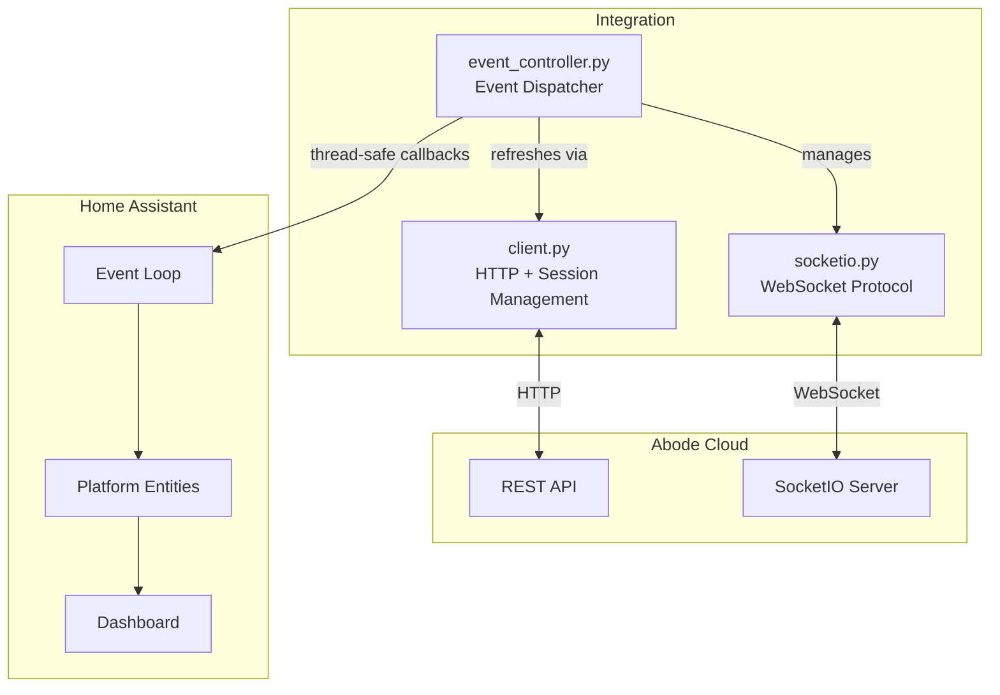
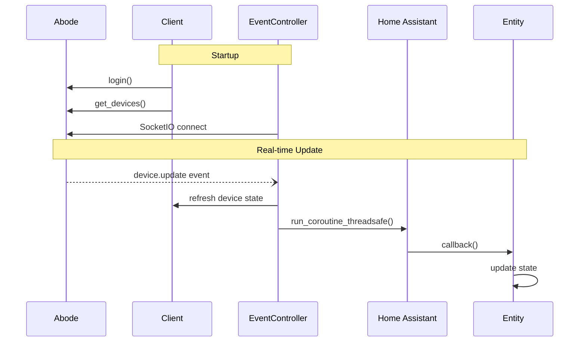

# Architecture

## Overview

This integration bridges Abode security systems with Home Assistant, merging the `jaraco.abode` library with modern async patterns and adding manual alarm triggering.



## Core Components

### Client (`abode/client.py`)

REST API gateway with session management:

- **Async HTTP** via `aiohttp` with connection pooling
- **Session lifecycle**: Proactive recreation every 30 min (before Abode's 1.5h timeout)
- **Retry logic**: 3 attempts, exponential backoff, rate limit detection (429)
- **Auth**: Token management, MFA support, cookie sync to SocketIO

### EventController (`abode/event_controller.py`)

Thread-safe event dispatcher:

- **Threading model**: SocketIO runs in daemon thread, callbacks execute on HA event loop via `asyncio.run_coroutine_threadsafe()`
- **Callback types**: Device updates, timeline events, connection status
- **Event mapping**: Maps Abode event codes to groups (ALARM, ARM, DISARM, etc.)

### SocketIO (`abode/socketio.py`)

WebSocket protocol implementation (no external library):

- **Protocol stack**: WebSocket (lomond) → EngineIO → SocketIO
- **Reconnection**: Exponential backoff 5-30s
- **Events**: Device updates, mode changes, timeline events

## Data Flow



## Key Patterns

### Thread-Safe Callbacks

```python
# EventController dispatches to HA event loop
def _dispatch_callback(self, callback, *args):
    if self._event_loop:
        asyncio.run_coroutine_threadsafe(
            self._execute_callback(callback, *args),
            self._event_loop
        )
```

### Error Handling Decorator

```python
@handle_abode_errors("operation name")
async def entity_action(self):
    # Errors logged, not propagated to break HA
```

### Dual Operation Modes

- **Polling**: `async_update()` called by HA on interval
- **Event-driven**: Real-time via SocketIO, minimal polling fallback

## Unique Features

1. **Manual Alarm Triggering** - PANIC, FIRE, MEDICAL, BURGLAR alarms from HA
2. **Timeline Event Management** - Acknowledge/dismiss alarm events
3. **CMS Settings Control** - Test mode, monitoring active, dispatch settings
4. **Smart Session Management** - Proactive recreation, empty response detection

## File Structure

```
custom_components/abode_security/
├── __init__.py              # Setup, entry points, event wiring
├── config_flow.py           # Auth flow, options
├── entity.py                # Base classes (AbodeEntity, AbodeDevice)
├── models.py                # AbodeSystem, polling stats, event filter
├── decorators.py            # @handle_abode_errors
├── alarm_control_panel.py   # Alarm entity + manual triggers
├── [platform].py            # Other HA platforms
└── abode/                   # Embedded jaraco.abode
    ├── client.py            # REST API, session management
    ├── event_controller.py  # Event dispatcher
    ├── socketio.py          # WebSocket protocol
    └── devices/             # Device type implementations
```
