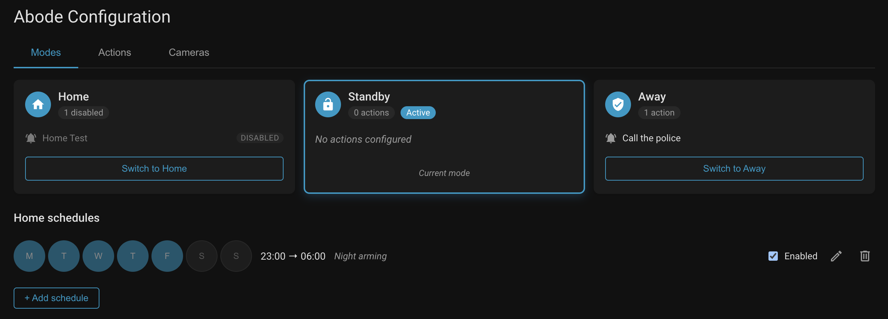
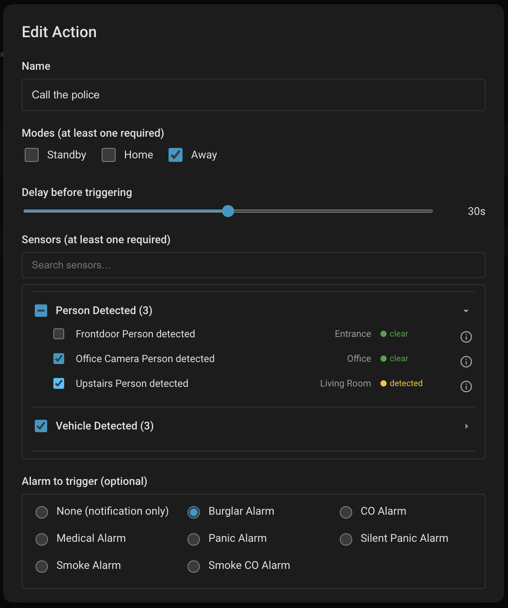
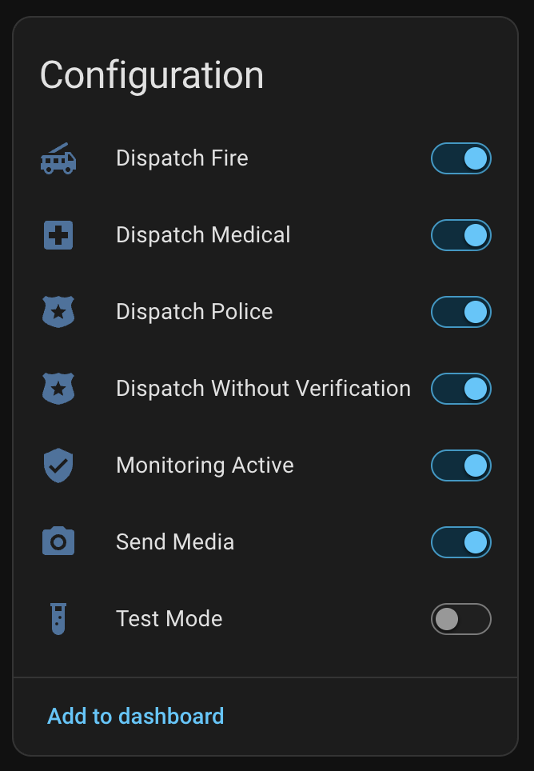

# Abode Security for Home Assistant

A drop-in replacement for the built-in Abode integration that lets you **trigger Abode alarms and actions from _any_ Home Assistant sensor or camera** — and edit your modes, actions, and schedules from a visual panel, no YAML required.

## Install

Click the button above to add the repository to HACS in one step, then **Download** and restart Home Assistant. Finally add the integration from **Settings → Devices & Services → Add Integration → Abode Security**.

Manual install

Copy `custom_components/abode_security` into your Home Assistant `custom_components/` directory and restart. Then add the integration as above.

## Why this integration?

The built-in Abode integration can only react to Abode's own sensors. This one lets **any Home Assistant entity** drive your alarm — a UniFi doorbell, a Zigbee motion sensor, a `template` binary sensor, anything HA can see.

| Feature | Built-in Abode | This integration |
|---|:---:|:---:|
| Abode devices (sensors, cameras, locks, alarm panel) | ✅ | ✅ |
| Trigger alarms & actions from **any HA sensor or camera** | ❌ | ✅ |
| Visual editor for modes, actions & schedules | ❌ | ✅ |
| Manual alarm trigger (panic / medical / CO / smoke / burglar) | ❌ | ✅ |
| Rich notifications with camera snapshots | ❌ | ✅ |
| Scheduled arming / disarming | ❌ | ✅ |

## Screenshots

| Modes & schedules | Action editor | Dispatch settings |
|---|---|---|
|  |  |  |

Define **modes** (Home / Standby / Away), attach **actions** that watch any HA sensors and optionally arm the panel, and set **schedules** for automatic arming — all from the integration's panel at `/abode_security`.

## Documentation

- [Configuration & actions](docs/configuration.md) — setup options and the full service/action reference
- [Notifications](docs/notifications.md) — camera-snapshot notifications and the bundled blueprint
- [Troubleshooting](docs/troubleshooting.md) — common issues, diagnostics, and FAQ
- [Architecture](docs/ARCHITECTURE.md) — design and data flow

## Acknowledgments

Builds on [jaraco.abode](https://github.com/jaraco/abode) and the original Home Assistant Abode integration, with added async support, a custom actions system, and the visual configuration panel.

## License

[MIT](LICENSE)
