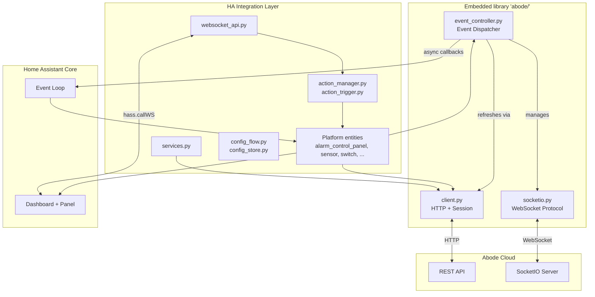
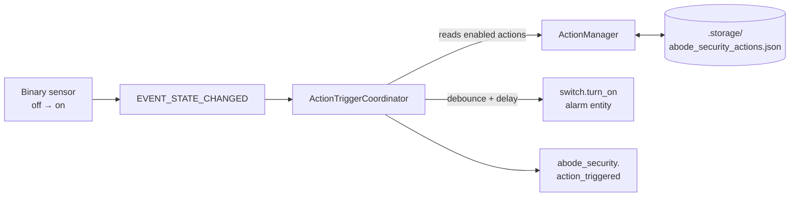
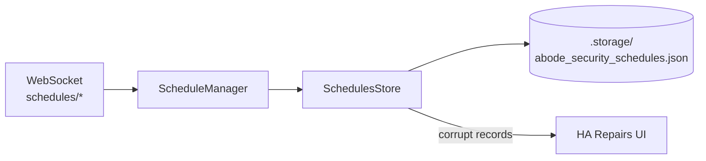
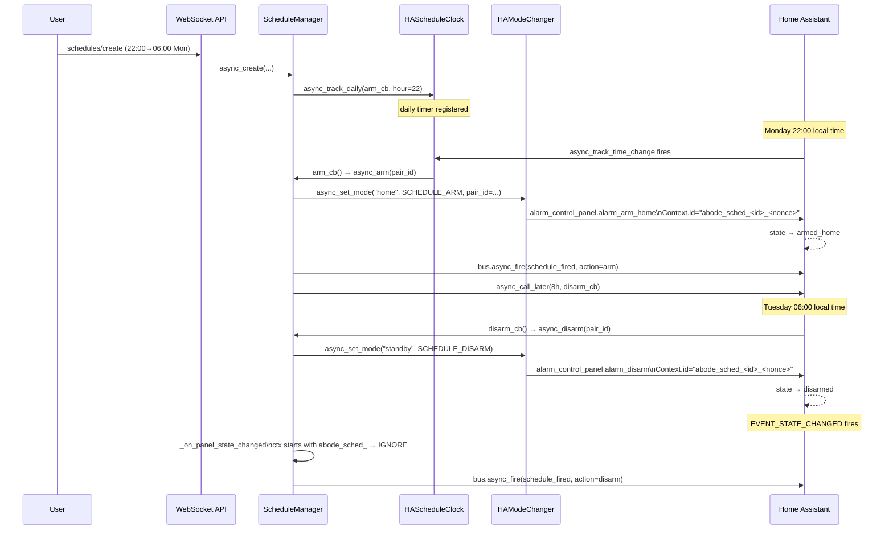
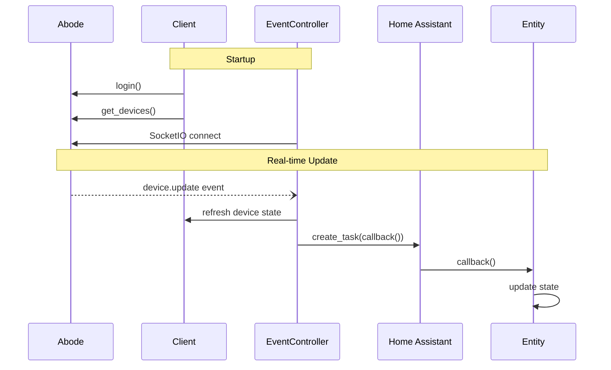

# Architecture

## Overview

This integration bridges Abode security systems with Home Assistant. It ships a vendored, modernized fork of `jaraco.abode` (in `custom_components/abode_security/abode/`) and a thin outer layer of HA platforms, services, a WebSocket API, and a Lit-based frontend panel.



## Layering

| Layer | Location | Role |
|---|---|---|
| Embedded library | `custom_components/abode_security/abode/` | Async Abode client, SocketIO protocol, event dispatch, device abstractions |
| HA integration | `custom_components/abode_security/` (top level) | Platforms, services, config flow, actions, WebSocket API |
| Frontend | `frontend/src/` | Lit-based configuration panel served at `/abode_security` |

**Boundary rule:** outer integration imports only from `abode.client`, `abode.exceptions`, `abode.helpers.timeline`, and `abode.devices.*`. Modules like `abode/automation.py`, `abode/state.py`, `abode/settings.py`, `abode/event_controller.py`, `abode/socketio.py`, `abode/_itertools.py` are library-internal.

## Core Components

### Client (`abode/client.py`)

REST API gateway with session management:

- **Async HTTP** via `aiohttp` with connection pooling
- **Session lifecycle**: proactive recreation every 30 min (before Abode's ~1.5h timeout)
- **Retry logic**: 3 attempts, exponential backoff, rate-limit (429) detection
- **Auth**: token management, MFA support, cookie sync to SocketIO

### EventController (`abode/event_controller.py`)

Event dispatcher:

- **Async model**: SocketIO runs as an async task on the HA event loop; async callbacks are dispatched via `asyncio.create_task()`, sync callbacks called inline
- **Callback types**: device updates, timeline events, connection status
- **Event mapping**: Abode event codes → groups (ALARM, ARM, DISARM, TEST, …) via `helpers/timeline.py`

### SocketIO (`abode/socketio.py`)

WebSocket protocol implementation (no external socketio library):

- **Protocol stack**: WebSocket (aiohttp) → EngineIO → SocketIO
- **Reconnection**: exponential backoff, 5–30 s
- **Events**: device updates, mode changes, timeline events

**Where to look first when SocketIO is unhappy**: check `diagnostics.py`'s `"socketio"` keys (`consecutive_connect_failures`, `last_packet_age_seconds`); run `mcp__home_assistant__ha_get_logs` filtered by `custom_components.abode_security`; see `tests/test_socketio_reconnect.py` for the reconnect contract. Broader async patterns are in [`docs/ASYNC_AWAIT_PATTERNS.md`](./ASYNC_AWAIT_PATTERNS.md).

### Devices (`abode/devices/`)

Per-type abstractions over raw Abode JSON. `base.Device` extends `Stateful`; subclasses add type-specific behavior: `alarm.py`, `binary_sensor.py`, `camera.py`, `cover.py`, `light.py`, `lock.py`, `sensor.py`, `switch.py`, `valve.py`. `pkg.py` and `status.py` hold the type registry and state mapping. `_ancestry.py` is a stdlib-only replacement for `jaraco.classes.ancestry.iter_subclasses`.

The `abode/` directory is a vendored fork of `jaraco.abode`. Fork lineage, intentional divergences, and the no-upstream-sync policy are documented in [`custom_components/abode_security/abode/UPSTREAM.md`](../custom_components/abode_security/abode/UPSTREAM.md).

### Helpers (`abode/helpers/`)

- `errors.py` — named error constants (`MFA_CODE_REQUIRED`, `SET_STATUS_STATE`, …) referenced across the library
- `timeline.py` — event-code → group mapping (`RangeMap`) plus CSV loader for metadata
- `urls.py` — endpoint URL templates
- `_collections.py` — stdlib-only `RangeMap` and `BijectiveMap`, replacing `jaraco.collections`

## HA Integration Layer

### Platforms

Standard HA platform modules (`alarm_control_panel.py`, `sensor.py`, `binary_sensor.py`, `switch.py`, `lock.py`, `cover.py`, `light.py`, `camera.py`). `entity.py` hosts base classes (`AbodeEntity`, `AbodeDevice`). `models.py` defines `AbodeSystem` (runtime holder for the client + event controller + stats) and event-filter helpers.

### Services (`services.py`, `services.yaml`)

Eight services grouped by theme:

| Theme | Service | Handler kind |
|---|---|---|
| Settings | `change_setting` | async (API call) |
| Media | `capture_image` | sync (dispatcher signal) |
| Automation | `trigger_automation` | sync (dispatcher signal) |
| Alarms | `trigger_alarm` | async (API call — PANIC, SILENT_PANIC, MEDICAL only) |
| Timeline | `acknowledge_alarm`, `dismiss_alarm` | async (API call) |
| Test mode | `enable_test_mode`, `disable_test_mode` | async (API call) |

Dispatcher-signal handlers are intentionally sync (see `ASYNC_AWAIT_PATTERNS.md`).

#### Manual alarm types

`switch.py` creates seven `AbodeManualAlarmSwitch` entities (`PANIC, SILENT_PANIC,
MEDICAL, CO, SMOKE_CO, SMOKE, BURGLAR`) because all seven can arrive *inbound* as timeline
alarm events, and the switch state mirrors that.

Only the three in `const.TRIGGERABLE_ALARM_TYPES` (`PANIC`, `SILENT_PANIC`, `MEDICAL`) can
be raised on request. `POST /integrations/v1/panel/alarm` rejects the other four:

```
400 {"errorCode":16013,"message":"invalid {{param}} value.",
     "errorProperties":{"action":"triggerAlarm","type":"BURGLAR"}}
```

This matches the official Abode Android app, whose manual-alarm screen only ever calls
`triggerManualAlarm` with Panic / Silent Panic / Medical even though its `AlarmType` enum
declares all seven. Turning on a non-triggerable switch raises `ServiceValidationError`
before any request is made, `entities/alarms` omits them from the action picker, and
`ActionManager.async_audit_alarm_targets()` raises a repair issue at startup for any stored
action still pointing at one.

Those three narrow the ways a doomed action can be reached; `ActionManager._validate_action`
closes the last one by refusing the write. `async_create` — and any `async_update` that
supplies `alarm_entity_ids` — runs each target through
`_alarm_target_failure_reason()` and raises `ValueError` (surfaced by the WebSocket layer as
`validation_error`) when the target is a non-triggerable Abode alarm type or sits outside
the `switch` domain. The same function backs the audit, so "what the panel refuses to
store" and "what the audit flags" cannot drift apart.

An update that *doesn't* supply `alarm_entity_ids` skips that check on purpose: a bad record
from a restored backup or a hand-edited storage file has to stay disableable and deletable,
or the only way out would be editing `.storage/abode_security_actions.json`. The panel's
enable/disable switch sends `enabled` alone and so keeps working; its *editor* always
resends the targets, so saving from there requires picking a supported alarm first.
Such records are deliberately **not** disabled at load either — a failing action still fires
`abode_security.action_triggered` with `alarm_outcome: failed` and `severity: critical`,
which is the only signal the user gets during the incident; the startup repair issue makes
sure it isn't silent.

##### Event-ID resolution and deferred dismissal

Raising the alarm is the `POST /integrations/v1/panel/alarm`; the timeline event ID is only
needed later, to *dismiss* it. Abode does not expose a triggered alarm on the timeline for
30-60 s, so `Alarm._find_timeline_alarm_event` polls on a `(0, 2, 5, 10, 20, 30)` backoff —
67 s in the worst case. That poll used to run inline inside `trigger_manual_alarm`, which
put it in front of `async_arm_alarm`, `_execute_action`, and therefore the
`action_triggered` event that drives the user's notification: a "call the police" action
notified 30-70 s after the break-in (#194).

`trigger_manual_alarm` now returns as soon as the POST is confirmed. The poll lives in
`Alarm.find_alarm_event_id()` (best-effort, never raises except `CancelledError`), which
`AbodeManualAlarmSwitch.async_turn_on` runs as an HA background task.

The ID has two sources and SocketIO is the authoritative one: `_alarm_event_callback` sets
`_timeline_id` when the `TimelineGroups.ALARM` event arrives, and the poll is the fallback
for when it does not. `async_turn_on` therefore clears `_timeline_id` *before* the POST, and
the poll result is discarded if SocketIO already supplied one.

Dismissal is what backgrounding put at risk, since `switch.turn_off` inside the resolution
window finds no ID. `async_turn_off` does not wait for one — the poll usually needs the full
30-60 s, and `PARALLEL_UPDATES = 1` means a blocked `turn_off` serializes the `switch.turn_on`
that raises the *next* alarm. Instead it marks the dismissal as owed on the lookup, and the
background task sends it once the ID lands.

That obligation is an `_EventIdLookup` — one object per lookup run, **handed to the task that
performs it** rather than left in entity state a later alarm cycle can overwrite. The task
reports an unsent dismissal from its own `finally`, reading the object it was given, so
"an abandoned dismissal is reported exactly once" holds by construction: one lookup per task,
one `finally` per task, no identity checks, and no verdict that has to survive an await.
`_cancel_event_id_lookup(settled=True)` marks the obligation settled before cancelling (the
alarm ended, or was just dismissed inline); every other caller leaves it outstanding, and a
cancellation that bypasses the helper entirely — HA stopping its background tasks at
shutdown — is covered by the same `finally` for free.

Which event the deferred dismissal targets is a deliberate choice, because
`dismiss_timeline_event` ignores one *specific* event (`POST timeline_ignore_alarm/<id>`). The
polled ID wins, and `_timeline_id` is only the fallback for a poll that came back empty on a
transient error — and then only while nothing newer has arrived. A `TimelineGroups.ALARM` event
landing after the dismissal was asked for may be a *new* alarm rather than a late event for
ours, and the payload cannot tell them apart, so it marks the lookup `superseded` and the
fallback is withdrawn. Failing to dismiss is loud and recoverable; silently ignoring an alarm
nobody has seen is neither.


Settling an obligation has one asymmetry worth knowing. `ALARM_END` settles it on fact — Abode
said the alarm is over. The inline branch of `async_turn_off` settles it on a judgement: it
just dismissed the ID now on the entity, and treats that as discharging an earlier request for
which no ID had arrived. In that situation the lookup is necessarily `superseded`, so this
resolves the same ambiguity `_async_send_dismissal` refuses to resolve, and in the opposite
direction. That is deliberate — deferral only happens when no ID had arrived, which makes the
late-own-event reading the likely one, and warning there would fire on the common path. The
accepted cost is that the rarer reading settles an obligation that was not met, silently;
per-event dismissal semantics are what make both readings survivable, since the other alarm
keeps its own ID.

What the poll guarantees is narrower than "the event this lookup triggered", and the ordering
above should not be read as more: `_find_timeline_alarm_event` accepts the newest event with
`is_alarm == '1'` whose age falls in `[0, 90]` seconds relative to the lookup's own start. The
forward bound is what makes it safe against the new-alarm case — a later alarm has a negative
age and is skipped. The backward bound is a flat 90 s, so a second alarm raised while the
first is still surfacing can be handed the first one's ID. Bounding that window against
elapsed lookup time is tracked in `features/pending.md`.

An earlier revision split this across three booleans on the entity, read from three reporting
sites. It took several rounds of review to stabilise and each fix exposed another instance of
the same bug class — entity-scoped state written by more than one owner across an await. The
handed-to-the-owner shape is the same behaviour with that class of bug made unrepresentable.

### Actions system (`action_manager.py`, `action_trigger.py`)

User-defined mappings from **sensor activation → event fire (and optionally an alarm trigger)**, gated by alarm mode.

- `ActionManager` — CRUD + persistence. Actions live in HA's `Store` API at `.storage/abode_security_actions.json`, keyed by UUID. In-memory cache during runtime.
- `ActionTriggerCoordinator` — listens to `EVENT_STATE_CHANGED`, matches binary-sensor `off→on` transitions against enabled actions, applies per-sensor debounce (default 1.0 s) and per-action delay (0–60 s via `async_call_later`), then calls `switch.turn_on` on each configured alarm entity (zero or more — an empty `alarm_entity_ids` list makes the action notification-only) and fires `abode_security.action_triggered`.
- Trigger state (pending delays, debounce timestamps) is memory-only; lost on restart by design.
- A debug-only `abode_security.fire_test_notification` service (gated by the `debug_logging` option) runs the snapshot + event-fire path for a chosen action and sensor without arming the panel — see [`docs/notifications.md`](./notifications.md).

The `abode_security.action_triggered` event payload carries 19 keys: the original 7 (`action_id`, `action_name`, `triggered_by`, `mode`, `alarms_triggered`, `alarms_failed`, `timestamp`), 6 sensor-context keys (`sensor_friendly_name`, `sensor_device_class`, `previous_state`, `new_state`, `sensor_area_id`, `sensor_area_name`), 3 snapshot keys (`camera_entity_id`, `snapshot_path`, `snapshot_error`), and 3 outcome keys (`alarm_outcome`, `alarm_failures`, `severity`). Context is captured at the moment of the `off→on` transition — not re-read at execute time — so delayed actions carry the state that caused the trigger rather than the current state.

`alarm_outcome` (`armed` / `partial` / `failed` / `none`) and `severity` (`critical` / `high` / `normal`) exist because `alarms_triggered` and `alarms_failed` shipped from the start and nothing ever read them: an action whose alarm was rejected by the API produced a notification identical to a successful one. Severity is computed in the integration (`action_trigger._severity`) rather than in the blueprint so custom automations escalate the same way, and a *failed* alarm is rated `critical` — the user believes monitoring was contacted when it was not. `_execute_action` also verifies rather than assumes, but only *before* the call: `async_arm_alarm` checks the target entity is in the `switch` domain, exists, and is available, because HA drops out-of-domain, missing, and unavailable entities from an entity service call and only logs it (`helpers/service.py`), and Abode entities go unavailable whenever the SocketIO stream drops. (The domain check matters because `cv.entity_id` on the WebSocket schemas validates the `domain.object_id` *format* only — a stored action naming `light.porch` would otherwise pass every guard and be recorded as armed.) A returning service call is then taken as success.

There is deliberately **no** post-call state check. Two were tried and both reported successfully raised alarms as failures: re-reading on/off races `_alarm_end_callback`, which clears `_attr_is_on` on every manual alarm switch; and re-reading availability is poisoned by `async_turn_on`'s own closing `async_write_ha_state()`, which stamps `unavailable` if availability flipped at any point during the call. That window was ~70 s wide until #194 moved the timeline lookup off this path and is now roughly one round-trip, but the race survives. The residual sub-millisecond window between the pre-check and HA's own filter errs toward `armed`, which is the correct direction against reporting a raised alarm as failed.

Failures raise a per-action repair issue via `action_repair.py` and are persisted as `AbodeAction.last_outcome` so the Actions panel can badge them.

When an action fires in `home` or `away` mode and the triggering binary_sensor shares an HA device (`device_id`) with a `camera.*` entity, `snapshot.py` captures a JPEG via the built-in `camera.snapshot` service and saves it under `/config/www/abode_security_snapshots/`. The `/local/abode_security_snapshots/<filename>` URL is exposed on the event as `snapshot_path`, making it directly usable as `data.image` in a mobile notification. Capture is bounded by a 3-second timeout; on failure the event still fires with `snapshot_path: null` and a short `snapshot_error` reason string. In `standby` mode, `camera_entity_id` is still resolved (so users can see the wiring) but no snapshot is taken.



### Scheduled arming subsystem (`scheduling/`)

`ScheduleManager` is the public entry point for recurring Home-mode arm/disarm schedules. Phases 1–3 are complete; Phase 4 (frontend) adds UI.

- `scheduling/models.py` — `ScheduledPair` dataclass (stores arm/disarm time + weekdays), `ChangeSource` and `SkipReason` enums. Pure Python; no HA dependencies beyond `homeassistant.util.dt`.
- `scheduling/store.py` — `SchedulesStore`: HA `Store`-backed persistence at `.storage/abode_security_schedules.json`. Mirrors `ActionStore` corruption handling: per-record drops are logged and surfaced as a repair issue; whole-file corruption raises the same issue with `count="unknown"`.
- `scheduling/repair.py` — thin wrappers over `issue_registry.async_create_issue` / `async_delete_issue` for the `corrupt_schedule_records` repair issue.
- `scheduling/clock.py` — `Clock` Protocol + `HAClock` impl. Wraps `dt_util.now()` / `dt_util.utcnow()` so tests can inject a fake clock.
- `scheduling/scheduler.py` — `ScheduleClock` Protocol + `HAScheduleClock` impl. Wraps `async_track_time_change` with weekday filtering inside the callback (HA has no weekday param). Returns a cancel handle. DST: non-existent local times are skipped on spring-forward; the first occurrence fires on fall-back.
- `scheduling/mode_changer.py` — `ModeChanger` Protocol + `HAModeChanger` impl. **The single production call site for `alarm_control_panel.*` service calls.** Stamps `Context.id = "abode_sched_<pair_id>_<8-hex-nonce>"` for schedule-initiated changes (`SCHEDULE_ARM`, `SCHEDULE_DISARM`, `RECONCILE_DISARM`) so the state-change listener can distinguish user from schedule transitions. `USER_WS` source gets a default (nil) context. Raises `ModeChangeFailed` (subclass of `HomeAssistantError`) when the panel is unavailable or the service call fails.
- `scheduling/state_machine.py` — `derive_state` pure function: pair is `ARMED` iff `last_armed_at > last_disarmed_at` and `now ≤ expected_disarm_at`. No side effects. `expected_disarm_at` computes the next occurrence of `disarm_time` ≥ `last_armed_at` in HA's local tz (DST-safe).
- `scheduling/retry.py` — `async_retry` with backoff (1 s / 4 s / 16 s, 4 total attempts). `RetryExhausted` carries the last error and attempt count. `async_retry_confirmed` wraps it with panel-state confirmation — see below.
- `scheduling/manager.py` — `ScheduleManager`: CRUD + full runtime. Registers one daily `ScheduleClock` handle per pair for the arm edge; disarm is a one-shot `async_call_later` registered after each successful arm. Reconciliation and the override listener both defer via `_defer_until_panel_exists` when the panel is not yet in `hass.states` — which is every setup — waiting on `EVENT_HOMEASSISTANT_STARTED` during startup and on the panel entity appearing thereafter (see the reload entry below). Fires `abode_security.schedule_fired / .schedule_skipped / .schedule_failed` events. Raises `schedule_fire_failed` repair issue after retry exhaustion; clears it on next success.
- `websocket_schedules.py` — five WS commands (`schedules/{list,get,create,update,delete}`). `list`/`get` open to any authenticated user; mutations require `@require_admin`.

**Context-id source-tagging convention** (Phase 2 onwards):

```
abode_sched_<pair_id>_<8-hex-nonce>
```

**The panel's state, not the HTTP response, decides whether a schedule fired** (#192). Arming takes ~60 s on real hardware, and Abode rejects a mode change issued while one is in progress with `600 / errorCode 2104 "Operation error!"`. The retry window is 21 s — shorter than the operation — so every retry landed mid-transition and the last one's error was reported as a total failure for an arm that had succeeded. `async_retry_confirmed` therefore consults a `confirm()` predicate (`_panel_state() == "armed_home"` / `== "disarmed"`) before every attempt, so a confirmed panel turns the remaining retries into no-ops rather than more `2104`s, and again after the attempts are exhausted, polling `hass.states` every 5 s for up to 90 s. Only a panel that never reaches the target mode produces `schedule_failed` and the `schedule_fire_failed` repair issue.

The window is sized against the panel's arming duration, not the retry window, and the poll reads `hass.states` only (the panel entity is updated by SocketIO push) so it adds no API traffic. The cost is that a *genuine* failure takes up to 90 s longer to raise its repair issue — deliberate: on a security integration, an ERROR alert for a schedule that worked trains the user to ignore the alert, which is the more harmful direction. This is the same class of bug as the false-failure paths fixed in #191, and note the opposite conclusion reached there for manual alarms: an alarm has no durable state to re-read, so a post-call check there produced false *failures*; a panel mode does, so checking it here removes them.

**`last_armed_at` / `last_disarmed_at` are anchored to the edge, not to the confirmation.** `expected_disarm_at` rolls forward a full day once the anchor is past `disarm_time`, and confirmation can now spend up to 111 s (21 s of retries plus the 90 s wait). Stamping the confirmation instant would leave a legal short window — arm 22:00 / disarm 22:01 — armed for ~24 h, with only an info log to show for it (`_schedule_disarm`'s negative-delay guard would not catch it: the delay is positive, just a day long).

Edge anchoring alone would then swing the same short window to the opposite failure — `_schedule_disarm` computes its delay against the *current* clock, so a boundary already passed during confirmation went negative and the guard dropped the disarm timer entirely, leaving the panel armed with nothing to disarm it. The guard now clamps: within `DISARM_WINDOW_GRACE` the disarm fires immediately, past it the timer is skipped. That is the same tolerance `derive_state` applies, so the two agree — inside the grace it reports `ARMED` and `async_disarm` acts; past it it reports `IDLE` and `async_disarm` would no-op anyway.

**`async_shutdown()` cancels in-flight work, not just timers** (#201). Every coroutine the manager starts goes through `_track`, which creates the task via `hass.async_create_task`, holds it in `_inflight`, and drops it again on completion; shutdown cancels the whole set and *gathers* it before returning. The three fire-and-forget callbacks (`_disarm_cb`, `_reconcile_disarm_cb`, the manual-override handler) and the deferred startup reconcile call `_track` directly, while `async_arm` / `async_disarm` await it through `_run_tracked` so that a direct caller is covered too — at the cost of one extra task there, since a coroutine cannot cancel the task awaiting it. Cancellation still propagates downwards (cancelling the caller cancels the inner task), so HA shutdown behaves exactly as before; what changed is config-entry unload, which used to return while the confirmation poll was still sleeping and let a store write, event, or repair issue land against a torn-down manager.

A `_shutdown` flag closes the follow-on races, because cancelling a task is not the same as preventing one: a timer creates its task inside its callback, before the handle is cancelled, so `_track` drops any coroutine that arrives after the sweep. The flag also guards `_start_panel_listener`, whose `EVENT_HOMEASSISTANT_STARTED` retry (since moved into `_defer_until_panel_exists`) would otherwise subscribe a dead manager to panel state changes — shutdown clears `_listener_handle`, so the "already registered" check alone does not stop it, and nothing would be left to unsubscribe it. That covers the startup shape; past startup the same deferral is a live subscription instead, which `async_shutdown` cancels outright — see the reload entry below.

**The manual-override listener compares against the last mode the panel was known to be in, not the event's `old_state`** (#216). `_on_panel_state_changed` treated any transition out of `armed_home` as the user taking over, and an Abode cloud dropout is exactly that shape: the entity goes `unavailable`, which is not `armed_home`, from an `old_state` that is. The `CONTEXT_ID_PREFIX` filter cannot help — HA mints a fresh context when it marks an entity unavailable, so the event never carries the scheduler's prefix. A 102-second SocketIO reconnect therefore cancelled the pending disarm and stamped `last_disarmed_at`, dropping the pair out of `ARMED` with nothing to re-arm it: the panel stayed in Home for the rest of the night. It was not silent on the bus — `_handle_manual_override` fires `schedule_skipped` with `reason=manual_override` for every armed pair it visits, so the event *was* there at 01:08 — but nothing on that install subscribed to it. The override path raises no repair issue (only retry exhaustion does), and the accompanying `_LOGGER.info` line went where INFO goes: into `home-assistant.log`, one line among thousands, surfaced nowhere in the UI. So the one signal that existed reached nobody, which is what the notifications guidance for this reason now says out loud.

`ScheduleManager._last_panel_state` holds the last `disarmed` / `armed_home` / `armed_away` the panel reported, and the listener works from that. `unavailable` and `unknown` return early *without* updating it, so the blip does not erase the fact that the panel was Home going into it — and the recovery edge back to `armed_home` hits the existing early return, so the original disarm timer is simply never touched. Naming those two states is exhaustive because `AbodeAlarm._sync_attrs` produces only those three modes plus `None`; a transitional `arming` or `triggered` would need this guard revisited.

Guarding only the `new_state` side would have fixed the strand but introduced a quieter bug, which is why the comparison moved off `old_state` entirely rather than just growing a second condition: a mode the user changed *while the panel was unavailable* is still a real override, and reading it from `old_state` (`unavailable`) loses that. Against the remembered mode, a panel that drops out of `armed_home` and returns `disarmed` or `armed_away` still registers on the way back. The field is written before the self-driven early return and unconditionally, because the manager's own disarm has to move it off `armed_home` too — behaviour the old code got for free from `old_state`.

Seeding happens in `_start_panel_listener`, synchronously with the subscription so no event can slip through the gap, and an already-unavailable panel seeds `None` ("never seen it Home"). `async_shutdown` clears it alongside `_listener_handle`; the two are a pair, and nothing restarts a shut-down manager today, but a remembered mode outliving the listener that maintained it is stale by construction.

One gap is deliberately left open: a dropout that outlasts the window. If the panel is still unavailable at `disarm_time`, `_disarm_impl` takes its conservative `panel_unavailable` branch, stamps `last_disarmed_at`, and does not re-attempt when the panel returns. Re-adopting the panel on recovery is the same mechanism #212 needs and is tracked there; `test_unavailable_across_disarm_time_skips` pins the current landing so that change is a deliberate one.

**The listener's deferral has to survive a config-entry reload, not just a boot** (#216). `async_setup` runs before `async_forward_entry_setups`, so the alarm_control_panel entity is *never* in `hass.states` when `_start_panel_listener` first runs — the deferral is the normal path on every setup, not an unusual one. Deferring to `EVENT_HOMEASSISTANT_STARTED` is correct during startup, but that event fires once per process: after an options change, a HACS update, or the Reload button, the new manager subscribed to something that would never fire, `_listener_handle` stayed `None`, and the manual-override listener was dead until the next full restart. On a security integration that is the whole feature silently absent, and it capped the value of the fix above.

`_defer_until_panel_exists` therefore picks its trigger from `hass.state`: still starting, keep the `EVENT_HOMEASSISTANT_STARTED` one-shot; already running, watch the `alarm_control_panel` domain with `async_track_state_added_domain` and run the deferred action once *our* panel resolves (`_panel_entity_id()` is re-checked on each arrival, so another integration's panel does not claim it). Unlike the one-shot — which the `_shutdown` flag alone neutralises — this is a live subscription, so handles are parked in `_panel_wait_handles`, keyed per caller, and cancelled once the deferred action runs and by `async_shutdown`; otherwise a torn-down manager would stay subscribed to every alarm panel that appears afterwards. A repeat deferral for a key already waiting is a no-op rather than a second subscription: `_start_panel_listener`'s own guard tests `_listener_handle`, which is still `None` while deferred, so without the per-key check a second call would overwrite the stored handle and orphan the first. (Reconciliation cannot re-enter — `_reconcile_deferred` is set before it defers — so for that caller the check is only defence.)

Both deferrals go through it, because `async_reconcile_on_startup` had the same trap and the worse consequence. `_register_all_timers` only restores the daily *arm* callback — reconciliation is the only thing that rebuilds a one-shot **disarm** — so a reload landing mid-window left the panel armed with nothing scheduled to disarm it at all, which is #216's own symptom reached by the sibling path. `_schedule_disarm` is normally called by the arm edge (and by the `already_home` skip; `async_update` also calls it, but only ever to *re*-register a timer it found pending), but after a reload none of those have run — reconciliation is the only thing that rebuilds the handle, so the override listener would have had nothing to cancel. Fixing one without the other would have been half a fix. The two are not symmetrical in what a *missing* panel means, though. Reconciliation still has work to do without one — its conservative `reconcile_panel_not_home` branch is what stops `last_armed_at` from sitting ahead of `last_disarmed_at` forever — so it passes `on_missing_panel=RUN_WITHOUT_PANEL` and runs anyway: immediately on the startup retry, and via a `PANEL_WAIT_TIMEOUT` backstop on the state-added path, which would otherwise wait for an entity that is never coming. That timeout is floored at HA's own `SLOW_SETUP_MAX_WAIT` (the test asserts `>=`, not equality — overshooting is harmless, undershooting is not): platforms forward in milliseconds in practice, but HA permits them 300 s, and a backstop that fires first would stamp `last_disarmed_at` against a panel that was merely late — reintroducing the stranding by a third route. The listener has nothing to listen to, so it does not proceed; on the startup retry it logs a warning and gives up with the one-shot spent, while past startup it warns once and keeps the subscription, so a panel that appears late is still adopted.

**Runtime fields are merged onto a freshly re-read pair, never written back from a copy captured before an `await`** (#202). `ScheduledPair` is a mutable dataclass and `SchedulesStore.async_update` re-inserts the whole record by id, so the last writer used to win every field rather than only the ones it owns — and `ScheduleManager.async_update` (the WS path) builds a *new* instance. An edit landing during the ~111 s confirmation window was therefore undone when the arm finished. `_persist_runtime` is the single write path for the four runtime-owned fields (`last_armed_at`, `last_disarmed_at`, `last_skip_reason`, `last_error`); it re-reads from the store immediately before persisting, and those four are disjoint from the user-editable set (`name`, `weekdays`, `arm_time`, `disarm_time`, `enabled`), which is what makes the field-level merge unambiguous. It returns `None` for a pair deleted mid-flight, which is the other half of the same bug — the write-back used to re-create the record; callers bail instead, leaving the panel armed with no auto-disarm exactly as an `async_delete` a second later already would. Because those two success paths are also the only callers of `_clear_fire_failed_issue`, `async_delete` now clears that repair issue itself; otherwise bailing would strand an `is_fixable=False` issue naming a schedule that no longer exists.

**Re-reading before the write is not sufficient on its own, because the write itself suspends.** `SchedulesStore.async_update` is an immediate, non-debounced `Store.async_save`, so it parks on real disk I/O, and an edit landing in *that* window installs a new instance — one that keeps the runtime fields (its own read happens after the synchronous cache write) but carries the user's edits. So `_persist_runtime` returns whatever is stored once the write settles, not the object it wrote, and callers use *that* for the event payload and for `_schedule_disarm`. Without it the disarm timer anchors to the old `disarm_time` while the store holds the new one, with no second line of defence: at that instant the WS path's `had_pending_disarm` is `False`, because the arm has not installed its handle yet, so it does not reschedule either.

`async_reconcile_on_startup` and `_handle_manual_override` iterate ids and re-read each one rather than holding what `get_all()` returned, since both `await` inside the loop. In the reconcile loop that is what keeps `expected_disarm_at` — the anchor for the disarm timer it registers — computed from the user's current `disarm_time`; in the override loop it is the `enabled` and `derive_state` guards that need to see the record as it stands. Cancelling the in-flight operation from `async_update` was considered and rejected: the mode change is already sent and Abode takes ~60 s regardless of whether anyone is still waiting, so cancelling would lose `last_armed_at` — the first known consequence listed below — to fix something the merge already fixes. Relatedly, `_set_disarm_handle` cancels the handle it replaces rather than overwriting the dict entry blind; the orphaned timer still fired, and only `_disarm_impl`'s `derive_state` guard kept that harmless.

**Unload quiesces the schedule manager first.** `_async_teardown_runtime` calls `async_shutdown()` *before* `events.stop()` / `logout()` / `cleanup()`, and `async_unload_entry` runs it immediately after `async_unload_platforms`. Reversed, an in-flight arm would spend the rest of its retry window issuing panel commands against a logged-out session, and a failure resolving in that window would still fire `schedule_failed` and raise the repair issue — the very thing the cancellation exists to prevent. `test_unload_quiesces_schedules_before_the_session` asserts the order, not just the call.

**That whole sequence is gated on the platform unload succeeding** (#206). The steps live in `_async_teardown_runtime`; `async_unload_entry` returns `False` before reaching it when `async_unload_platforms` reports a failure. HA then marks the entry `FAILED_UNLOAD` and leaves whatever platforms did not unload holding live entities, so tearing the session down would leave those entities pointing at a logged-out client — `events.stop()` included, since the SocketIO push is the only thing keeping them current, which is why nothing is exempted from the gate. HA applies the same rule to the `async_on_unload` callbacks (the daily snapshot purge timer among them): it runs them only when `async_unload_entry` returns `True`.

`FAILED_UNLOAD` is not recoverable, so `async_unload` short-circuits on it and `async_unload_entry` is never re-entered for that entry — a restart or removal is the only exit. `async_remove_entry` therefore calls `_async_teardown_runtime` too: at removal the entities go away with the entry, so the runtime kept alive for them must not outlive it, or a remove-then-re-add without a restart would leave a second schedule manager, action coordinator and SocketIO stream running alongside the new ones. The helper is idempotent (`runtime_data` is deleted by HA on a successful unload, and every `hass.data` access is guarded), so the ordinary remove-after-clean-unload path runs it against nothing — `async_unload_entry` still reads `entry.runtime_data` directly, keeping a missing runtime loud on the path where it would be a real bug. Removing an entry from `SETUP_ERROR` / `SETUP_RETRY` is the helper's third entry point: HA does not delete `runtime_data` when `async_unload` short-circuits on a non-`LOADED` state, so a setup that failed *after* `entry.runtime_data` was assigned leaves a half-initialised `AbodeSystem` attached. Tearing it down there is safe and mildly useful — `logout()` returns early without a token — and it closes the aiohttp session those setup-failure paths would otherwise leak.

Every step in the helper runs through `_async_teardown_step`, which logs instead of raising. `Client.logout()` only swallows `ClientError`/`OSError`, so a 4xx — a 429 from the rate-limited API being the realistic one — would otherwise abort the rest of the teardown, and on the `async_remove_entry` path that abort is invisible: HA swallows the exception and deletes the entry regardless, leaving the ghost runtime with one ERROR line and no exit short of a restart. `CancelledError` is a `BaseException` and is not caught, so HA shutdown still propagates as before.

The daily snapshot purge timer is the one subscription that needs explicit handling: it is registered with `entry.async_on_unload`, which HA runs only on a successful unload, so the remove-after-`FAILED_UNLOAD` path would never reach it. Its unsubscribe handle is therefore also parked at `hass.data[DOMAIN]["unsub_purge"]` and cancelled by the helper, which is safe to do twice (`async_track_time_interval`'s cancel just cancels the timer handle). Otherwise a remove-then-re-add would leave a ghost timer purging snapshots against the *removed* entry's retention option.

Two consequences of the wider in-flight window are known and **not** addressed here:

- **A cancelled arm loses its anchor while the panel keeps arming.** `last_armed_at` is persisted only after confirmation returns, but the mode change was already sent and Abode takes ~60 s regardless of whether anyone is still waiting. Cancel inside that window and the store keeps `last_armed_at = None`, so the next setup's `async_reconcile_on_startup` skips the pair (it only considers pairs with an anchor) and no disarm is registered; the panel stays in Home until the next day's arm edge takes the `already_home` path. This was already true of HA shutdown, which has always cancelled the poll — extending it to config-entry unload makes it deterministic rather than incidental. Persisting the anchor optimistically and clearing it on `RetryExhausted` would fix it, but it would also make `derive_state` report `ARMED` throughout the confirmation window, which changes what the manual-override listener and the WS list see; that is a larger behaviour change than #201 called for. The narrower variant — catch `CancelledError`, persist, re-raise — avoids that but is worse in a different way: `SchedulesStore.async_update` is an immediate, non-debounced `Store.async_save`, so it would mean awaiting real disk I/O from inside a cancellation handler during entry unload, reintroducing the late store write this change exists to eliminate and extending unload by the length of that write. The failure direction is also the safe one — the panel stays armed rather than unarmed.
- If the *user* manually arms Home during the confirmation poll, the manager reports `schedule_fired`, whereas the pre-existing "panel is already Home" path reports `schedule_skipped` with `reason=already_home`. Both take ownership and schedule the disarm, so behaviour matches; only the event classification differs for the same physical situation.

`HAClock`, `HAScheduleClock`, and `HAModeChanger` are instantiated once in `async_setup_entry` and stored at `hass.data[DOMAIN]["clock"]`, `hass.data[DOMAIN]["schedule_clock"]`, and `hass.data[DOMAIN]["mode_changer"]` respectively. All three are domain-scoped (safe because `manifest.json` declares `single_config_entry: true`).



**Runtime sequence (arm fires → context-id propagates → listener handles):**



### WebSocket API (`websocket_api.py`)

Frontend-facing command registry. All commands namespaced `abode_security/*`:

- **Actions CRUD**: `actions/{list,get,create,update,delete,toggle,test}`
- **Schedules CRUD**: `schedules/{list,get,create,update,delete}` (Phase 1; runtime in Phase 3)
- **Entity queries**: `entities/sensors`, `entities/alarms`, `entities/cameras`, `modes/list`
- **Config**: `config/{get,set}` (debounce, etc.)

Mutating commands (`create`, `update`, `delete`, `toggle`, `config/set`) require admin. `test` directly invokes an alarm trigger without persisting, for form validation.

**Hidden-entity asymmetry.** `entities/sensors` filters out entries where `hidden_by is not None` so users can't accidentally pick a sensor they've intentionally hidden from the UI. The `ActionTriggerCoordinator` *does not* apply the same filter — it listens on `EVENT_STATE_CHANGED` regardless of `hidden_by`, so existing actions referencing a now-hidden sensor keep firing. Hiding an entity is a UI-clutter decision, not a "retire this automation" signal.

### Config flow (`config_flow.py`, `config_store.py`)

| Step | Purpose |
|---|---|
| `user` | Username + password |
| `mfa` | Conditional, when Abode challenges for a code |
| `reauth` | Re-prompts password on `ConfigEntryAuthFailed` |
| Options flow | Polling interval, event enable, retry count, debug logging |

Storage split:

- **Entry data** (immutable after install) — username, password, polling flag
- **Entry options** (user-modifiable) — polling interval, event enable, retry count, debug logging
- **Config store** (`.storage/abode_security_config.json`, managed by `ConfigStore`) — runtime settings like action-trigger debounce; separate from entry so tweaks don't require reauth

## Frontend Panel (`frontend/src/`)

Lit component `abode-configuration-panel`, registered as HA panel at `/abode_security`, served from `custom_components/abode_security/www/`. Built from `frontend/` (TypeScript + Lit + esbuild).

Three tabs:

- **Actions** — list with enable/disable/edit/delete/test, plus a form editor that multi-selects sensors and alarm entities
- **Modes** — Standby / Home / Away with active indicator and per-mode action counts; the tab also hosts the **Schedules section** (see below)
- **Cameras** — lists every camera entity in HA (`entities/cameras` WS endpoint). The integration is camera-source-agnostic — any camera is a valid notification deep-link target. Each card renders HA's native `<ha-camera-stream>` element (the same renderer the picture-entity Lovelace card uses with `camera_view: auto`), so auth, HLS/WebRTC fallback, and stream lifecycle are delegated to HA. Tapping a card dispatches `hass-more-info` for that entity, matching picture-entity's `tap_action: more-info`. Deep-link URL scheme: `?tab=cameras&camera=<entity_id>` — parsed at field-init time to mount directly on the target tab without a flash. On deep-link arrival the matching card scrolls/highlights *and* the component fires `hass-more-info` once so the user lands on the live-stream popup; closing the popup reveals the grid below. Notification blueprint sets `url`/`clickAction` to this path.

Communication is **WebSocket-only** via `hass.callWS()`; no custom REST endpoints. Command schemas live in `frontend/src/api.ts`.

### Schedules UI (`abode-schedules-section`)

An always-visible section mounted below the mode cards in `abode-modes-tab`. Three components compose it:

- **`abode-day-chip-picker`** — reusable 7-chip weekday multi-select (Mon–Sun). Fires `change` events with `bubbles: true, composed: true`. Each chip is a native `<button>` with `aria-pressed` and full-name `aria-label` for disambiguation.
- **`abode-schedule-row`** — single row with view and inline-edit modes. View mode renders day chips (read-only), arm→disarm times, enabled toggle, and admin-only edit/delete icons. Edit mode renders the chip picker, two `<input type="time">` pickers, optional name field, enabled toggle, and Save/Cancel. Client-side validation runs before any WS call. `save` events carry `{ id, data: ScheduleCreateInput }`; `id === ''` signals a new row.
- **`abode-schedules-section`** — list container. Fetches schedules on mount via `schedules/list`, delegates save/delete/cancel-new events from child rows via event delegation on the `<section>` element. Admin gating hides Add/edit/delete controls for non-admin users (UX layer only; `@require_admin` is enforced server-side). Confirm-delete uses `abode-modal` with `variant="alertdialog"`.

Data flow: section fetches list → renders rows → row save dispatches event → section calls `createSchedule`/`updateSchedule` → replaces local copy on success. No live push updates in v1 (the section only refreshes on mount).

## Data Flow



## Key Patterns

### Async Callbacks

```python
# _execute_callback — async callbacks as tasks, sync callbacks inline
def _execute_callback(callback, *args, **kwargs):
    if inspect.iscoroutinefunction(callback):
        task = asyncio.create_task(_run_callback_async(callback, args, kwargs))
        task.add_done_callback(lambda t: _log_task_completion(callback, t))
    else:
        callback(*args, **kwargs)
```

### Error Handling Decorator (`decorators.py`)

```python
@handle_abode_errors("operation name")
async def entity_action(self):
    # Errors logged, not propagated to break HA
```

### Timeout-Guarded Executor Jobs

Callback registration via `hass.async_add_executor_job(...)` is wrapped in `asyncio.wait_for(..., timeout=10.0)`; timeouts are treated as non-fatal (polling continues). See `ASYNC_AWAIT_PATTERNS.md` for rationale and call sites.

### Entity Availability Composition

Within `AbodeEntity` / `AbodeDevice`, `_attr_available` has two writers — the
SocketIO connection callback and the device-state sync — so both go through
`AbodeEntity._resolve_available()` instead of assigning the attribute
directly. Without that single resolution point a SocketIO reconnect would
silently mark an offline device available again.

(`switch.py`'s alarm-attached switches predate this and still assign
`_attr_available` directly, so a CMS switch that marks itself unavailable
after repeated poll errors is reset by the next connection-status callback.
Known gap, not covered by the hook.)

```python
class AbodeEntity(Entity):
    _connection_available = True          # SocketIO half; assumed up until told

    def _resolve_available(self) -> bool:
        return self._connection_available

class AbodeBinarySensor(AbodeDevice, BinarySensorEntity):
    def _resolve_available(self) -> bool:
        return super()._resolve_available() and self._device.is_reporting
```

Only binary sensors fold in a per-device signal (`#210`). A contact or motion
sensor that reports `Offline` — or faults `no_response` — is holding a stale
status, and letting that stale status read as `off` turned an offline blip on
an open window into a fresh `off` -> `on` activation, which is exactly what
`ActionTriggerCoordinator._handle_state_change` fires on. Reporting
`unavailable` instead lands it on the transition the coordinator already
rejects.

Two deliberate boundaries:

- **Link-state tags are exempt** (`_LINK_STATE_TAGS` in
  `abode/devices/binary_sensor.py`): `glass`, `keypad`, `remote_controller`,
  `siren`, `bx`. These report `Online` as their steady state and deliver real
  events over the timeline, so `Offline` is the reading itself, not staleness
  — withholding it would erase the only state those entities report. The
  exemption is keyed on tag rather than on the `Connectivity` class because
  that class is overloaded: `water_sensor` reports `On`/`Off` for moisture,
  and `smoke_detector` / `fix_panic` are unverified, so all three take the
  staleness treatment instead. Those are exactly the sensors a user wires an
  action to, and `ActionTriggerCoordinator._handle_state_change` does not
  filter by device class.
- **Other device platforms are not covered.** Lights, locks, covers, cameras,
  and sensors keep showing their last known state while offline. The false
  trigger lives only on the binary-sensor path, so widening it was left out of
  `#210` rather than silently bundled in.

### Dual Operation Modes

- **Polling** — `async_update()` on HA's interval (fallback and CMS-settings refresh)
- **Event-driven** — real-time via SocketIO for everything else; minimal polling

## Unique Features

1. **Manual alarm triggering** — PANIC, SILENT_PANIC, MEDICAL from HA
2. **Custom actions** — sensor-to-alarm mappings gated by mode, with delay and debounce
3. **Timeline event management** — acknowledge/dismiss alarm events
4. **CMS settings control** — test mode, monitoring active, dispatch settings
5. **Smart session management** — proactive recreation, empty-response detection

## File Structure

```
abode-security/
├── custom_components/abode_security/
│   ├── __init__.py              # Setup, entry points, event wiring
│   ├── alarm_control_panel.py   # Alarm entity + manual triggers
│   ├── sensor.py / binary_sensor.py / switch.py / ...   # HA platforms
│   ├── entity.py                # Base classes
│   ├── models.py                # AbodeSystem, stats, event filter
│   ├── decorators.py            # @handle_abode_errors
│   ├── services.py / services.yaml
│   ├── config_flow.py / config_store.py
│   ├── action_manager.py / action_trigger.py
│   ├── websocket_api.py
│   ├── diagnostics.py
│   ├── www/                     # Built panel artifacts
│   └── abode/                   # Embedded jaraco.abode fork
│       ├── client.py            # REST API, session mgmt
│       ├── event_controller.py  # Event dispatcher
│       ├── socketio.py          # WebSocket protocol
│       ├── devices/             # Per-type device models
│       └── helpers/             # Timeline, errors, URLs, collections
├── frontend/src/                # Lit panel (TypeScript)
├── tests/                       # Unit + integration + e2e + mock server
└── docs/                        # This doc, async patterns, past reviews
```

## Daily Snapshot Purge

`__init__.py` registers a `async_track_time_interval` callback (interval 24 h, `cancel_on_shutdown=True`) that calls `snapshot.async_purge_old` to delete JPEG files in `/config/www/abode_security_snapshots/` older than the configured retention window. The retention is user-configurable via the integration's options flow (`snapshot_retention_days`, default 30, range 1–365). A startup call ensures the purge runs immediately on integration load without waiting 24 h.

## Related Docs

- [`ASYNC_AWAIT_PATTERNS.md`](./ASYNC_AWAIT_PATTERNS.md) — async design decisions and call-site inventory
- [`archive/CODE_REVIEW_2025_11_25.md`](./archive/CODE_REVIEW_2025_11_25.md) — prior async-focused review (historical snapshot)
