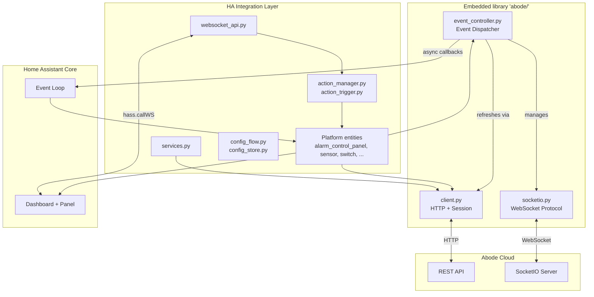
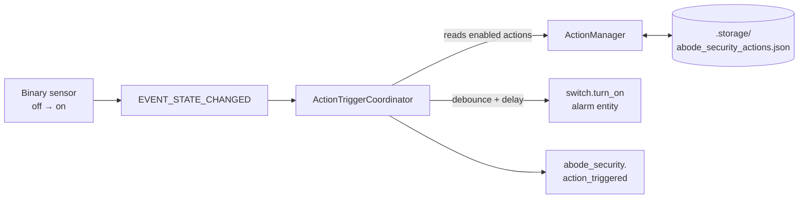
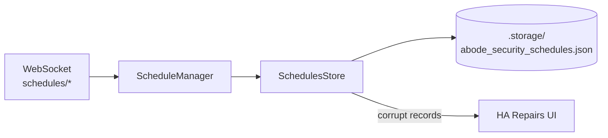
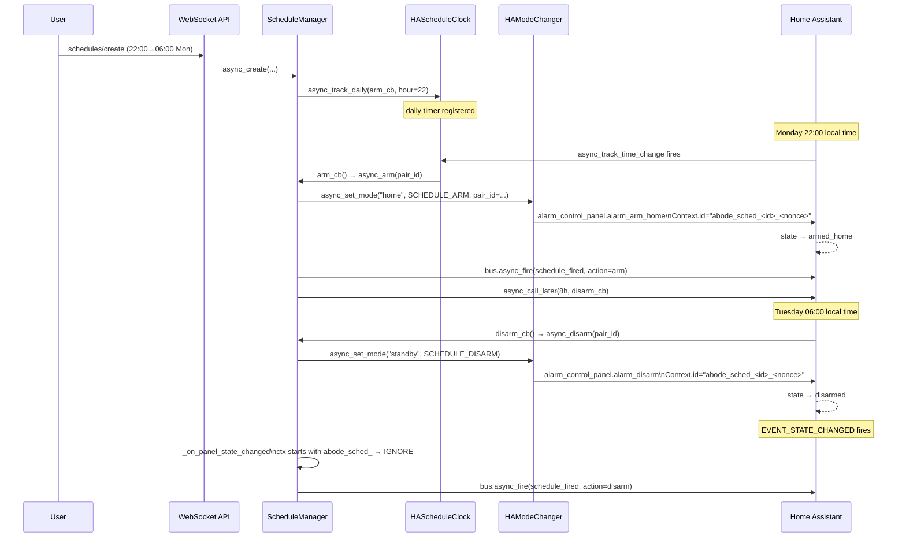
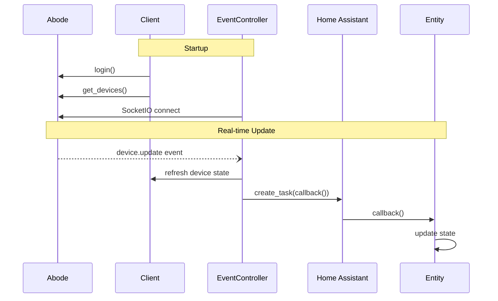

# Architecture

## Overview

This integration bridges Abode security systems with Home Assistant. It ships a vendored, modernized fork of `jaraco.abode` (in `custom_components/abode_security/abode/`) and a thin outer layer of HA platforms, services, a WebSocket API, and a Lit-based frontend panel.



## Layering

| Layer | Location | Role |
|---|---|---|
| Embedded library | `custom_components/abode_security/abode/` | Async Abode client, SocketIO protocol, event dispatch, device abstractions |
| HA integration | `custom_components/abode_security/` (top level) | Platforms, services, config flow, actions, WebSocket API |
| Frontend | `frontend/src/` | Lit-based configuration panel served at `/abode_security` |

**Boundary rule:** outer integration imports only from `abode.client`, `abode.exceptions`, `abode.helpers.timeline`, and `abode.devices.*`. Modules like `abode/automation.py`, `abode/state.py`, `abode/settings.py`, `abode/event_controller.py`, `abode/socketio.py`, `abode/_itertools.py` are library-internal.

## Core Components

### Client (`abode/client.py`)

REST API gateway with session management:

- **Async HTTP** via `aiohttp` with connection pooling
- **Session lifecycle**: proactive recreation every 30 min (before Abode's ~1.5h timeout)
- **Retry logic**: 3 attempts, exponential backoff, rate-limit (429) detection
- **Auth**: token management, MFA support, cookie sync to SocketIO

### EventController (`abode/event_controller.py`)

Event dispatcher:

- **Async model**: SocketIO runs as an async task on the HA event loop; async callbacks are dispatched via `asyncio.create_task()`, sync callbacks called inline
- **Callback types**: device updates, timeline events, connection status
- **Event mapping**: Abode event codes → groups (ALARM, ARM, DISARM, TEST, …) via `helpers/timeline.py`

### SocketIO (`abode/socketio.py`)

WebSocket protocol implementation (no external socketio library):

- **Protocol stack**: WebSocket (aiohttp) → EngineIO → SocketIO
- **Reconnection**: exponential backoff, 5–30 s
- **Events**: device updates, mode changes, timeline events

**Where to look first when SocketIO is unhappy**: check `diagnostics.py`'s `"socketio"` keys (`consecutive_connect_failures`, `last_packet_age_seconds`); run `mcp__home_assistant__ha_get_logs` filtered by `custom_components.abode_security`; see `tests/test_socketio_reconnect.py` for the reconnect contract. Broader async patterns are in [`docs/ASYNC_AWAIT_PATTERNS.md`](./ASYNC_AWAIT_PATTERNS.md).

### Devices (`abode/devices/`)

Per-type abstractions over raw Abode JSON. `base.Device` extends `Stateful`; subclasses add type-specific behavior: `alarm.py`, `binary_sensor.py`, `camera.py`, `cover.py`, `light.py`, `lock.py`, `sensor.py`, `switch.py`, `valve.py`. `pkg.py` and `status.py` hold the type registry and state mapping. `_ancestry.py` is a stdlib-only replacement for `jaraco.classes.ancestry.iter_subclasses`.

The `abode/` directory is a vendored fork of `jaraco.abode`. Fork lineage, intentional divergences, and the no-upstream-sync policy are documented in [`custom_components/abode_security/abode/UPSTREAM.md`](../custom_components/abode_security/abode/UPSTREAM.md).

### Helpers (`abode/helpers/`)

- `errors.py` — named error constants (`MFA_CODE_REQUIRED`, `SET_STATUS_STATE`, …) referenced across the library
- `timeline.py` — event-code → group mapping (`RangeMap`) plus CSV loader for metadata
- `urls.py` — endpoint URL templates
- `_collections.py` — stdlib-only `RangeMap` and `BijectiveMap`, replacing `jaraco.collections`

## HA Integration Layer

### Platforms

Standard HA platform modules (`alarm_control_panel.py`, `sensor.py`, `binary_sensor.py`, `switch.py`, `lock.py`, `cover.py`, `light.py`, `camera.py`). `entity.py` hosts base classes (`AbodeEntity`, `AbodeDevice`). `models.py` defines `AbodeSystem` (runtime holder for the client + event controller + stats) and event-filter helpers.

### Services (`services.py`, `services.yaml`)

Eight services grouped by theme:

| Theme | Service | Handler kind |
|---|---|---|
| Settings | `change_setting` | async (API call) |
| Media | `capture_image` | sync (dispatcher signal) |
| Automation | `trigger_automation` | sync (dispatcher signal) |
| Alarms | `trigger_alarm` | async (API call — PANIC, SILENT_PANIC, MEDICAL only) |
| Timeline | `acknowledge_alarm`, `dismiss_alarm` | async (API call) |
| Test mode | `enable_test_mode`, `disable_test_mode` | async (API call) |

Dispatcher-signal handlers are intentionally sync (see `ASYNC_AWAIT_PATTERNS.md`).

#### Manual alarm types

`switch.py` creates seven `AbodeManualAlarmSwitch` entities (`PANIC, SILENT_PANIC,
MEDICAL, CO, SMOKE_CO, SMOKE, BURGLAR`) because all seven can arrive *inbound* as timeline
alarm events, and the switch state mirrors that.

Only the three in `const.TRIGGERABLE_ALARM_TYPES` (`PANIC`, `SILENT_PANIC`, `MEDICAL`) can
be raised on request. `POST /integrations/v1/panel/alarm` rejects the other four:

```
400 {"errorCode":16013,"message":"invalid {{param}} value.",
     "errorProperties":{"action":"triggerAlarm","type":"BURGLAR"}}
```

This matches the official Abode Android app, whose manual-alarm screen only ever calls
`triggerManualAlarm` with Panic / Silent Panic / Medical even though its `AlarmType` enum
declares all seven. Turning on a non-triggerable switch raises `ServiceValidationError`
before any request is made, `entities/alarms` omits them from the action picker, and
`ActionManager.async_audit_alarm_targets()` raises a repair issue at startup for any stored
action still pointing at one.

### Actions system (`action_manager.py`, `action_trigger.py`)

User-defined mappings from **sensor activation → event fire (and optionally an alarm trigger)**, gated by alarm mode.

- `ActionManager` — CRUD + persistence. Actions live in HA's `Store` API at `.storage/abode_security_actions.json`, keyed by UUID. In-memory cache during runtime.
- `ActionTriggerCoordinator` — listens to `EVENT_STATE_CHANGED`, matches binary-sensor `off→on` transitions against enabled actions, applies per-sensor debounce (default 1.0 s) and per-action delay (0–60 s via `async_call_later`), then calls `switch.turn_on` on each configured alarm entity (zero or more — an empty `alarm_entity_ids` list makes the action notification-only) and fires `abode_security.action_triggered`.
- Trigger state (pending delays, debounce timestamps) is memory-only; lost on restart by design.
- A debug-only `abode_security.fire_test_notification` service (gated by the `debug_logging` option) runs the snapshot + event-fire path for a chosen action and sensor without arming the panel — see [`docs/notifications.md`](./notifications.md).

The `abode_security.action_triggered` event payload carries 19 keys: the original 7 (`action_id`, `action_name`, `triggered_by`, `mode`, `alarms_triggered`, `alarms_failed`, `timestamp`), 6 sensor-context keys (`sensor_friendly_name`, `sensor_device_class`, `previous_state`, `new_state`, `sensor_area_id`, `sensor_area_name`), 3 snapshot keys (`camera_entity_id`, `snapshot_path`, `snapshot_error`), and 3 outcome keys (`alarm_outcome`, `alarm_failures`, `severity`). Context is captured at the moment of the `off→on` transition — not re-read at execute time — so delayed actions carry the state that caused the trigger rather than the current state.

`alarm_outcome` (`armed` / `partial` / `failed` / `none`) and `severity` (`critical` / `high` / `normal`) exist because `alarms_triggered` and `alarms_failed` shipped from the start and nothing ever read them: an action whose alarm was rejected by the API produced a notification identical to a successful one. Severity is computed in the integration (`action_trigger._severity`) rather than in the blueprint so custom automations escalate the same way, and a *failed* alarm is rated `critical` — the user believes monitoring was contacted when it was not. `_execute_action` also verifies rather than assumes, but only *before* the call: `async_arm_alarm` checks the target entity is in the `switch` domain, exists, and is available, because HA drops out-of-domain, missing, and unavailable entities from an entity service call and only logs it (`helpers/service.py`), and Abode entities go unavailable whenever the SocketIO stream drops. (The domain check matters because `cv.entity_id` on the WebSocket schemas validates the `domain.object_id` *format* only — a stored action naming `light.porch` would otherwise pass every guard and be recorded as armed.) A returning service call is then taken as success.

There is deliberately **no** post-call state check. Two were tried and both reported successfully raised alarms as failures: re-reading on/off races `_alarm_end_callback`, which clears `_attr_is_on` on every manual alarm switch; and re-reading availability is poisoned by `async_turn_on`'s own closing `async_write_ha_state()`, which stamps `unavailable` if availability flipped at any point during a call that blocks for the inline timeline lookup (67 s of retry delays — see #194). The residual sub-millisecond window between the pre-check and HA's own filter errs toward `armed`, which is the correct direction against a ~70 s false-failure window.

Failures raise a per-action repair issue via `action_repair.py` and are persisted as `AbodeAction.last_outcome` so the Actions panel can badge them.

When an action fires in `home` or `away` mode and the triggering binary_sensor shares an HA device (`device_id`) with a `camera.*` entity, `snapshot.py` captures a JPEG via the built-in `camera.snapshot` service and saves it under `/config/www/abode_security_snapshots/`. The `/local/abode_security_snapshots/<filename>` URL is exposed on the event as `snapshot_path`, making it directly usable as `data.image` in a mobile notification. Capture is bounded by a 3-second timeout; on failure the event still fires with `snapshot_path: null` and a short `snapshot_error` reason string. In `standby` mode, `camera_entity_id` is still resolved (so users can see the wiring) but no snapshot is taken.



### Scheduled arming subsystem (`scheduling/`)

`ScheduleManager` is the public entry point for recurring Home-mode arm/disarm schedules. Phases 1–3 are complete; Phase 4 (frontend) adds UI.

- `scheduling/models.py` — `ScheduledPair` dataclass (stores arm/disarm time + weekdays), `ChangeSource` and `SkipReason` enums. Pure Python; no HA dependencies beyond `homeassistant.util.dt`.
- `scheduling/store.py` — `SchedulesStore`: HA `Store`-backed persistence at `.storage/abode_security_schedules.json`. Mirrors `ActionStore` corruption handling: per-record drops are logged and surfaced as a repair issue; whole-file corruption raises the same issue with `count="unknown"`.
- `scheduling/repair.py` — thin wrappers over `issue_registry.async_create_issue` / `async_delete_issue` for the `corrupt_schedule_records` repair issue.
- `scheduling/clock.py` — `Clock` Protocol + `HAClock` impl. Wraps `dt_util.now()` / `dt_util.utcnow()` so tests can inject a fake clock.
- `scheduling/scheduler.py` — `ScheduleClock` Protocol + `HAScheduleClock` impl. Wraps `async_track_time_change` with weekday filtering inside the callback (HA has no weekday param). Returns a cancel handle. DST: non-existent local times are skipped on spring-forward; the first occurrence fires on fall-back.
- `scheduling/mode_changer.py` — `ModeChanger` Protocol + `HAModeChanger` impl. **The single production call site for `alarm_control_panel.*` service calls.** Stamps `Context.id = "abode_sched_<pair_id>_<8-hex-nonce>"` for schedule-initiated changes (`SCHEDULE_ARM`, `SCHEDULE_DISARM`, `RECONCILE_DISARM`) so the state-change listener can distinguish user from schedule transitions. `USER_WS` source gets a default (nil) context. Raises `ModeChangeFailed` (subclass of `HomeAssistantError`) when the panel is unavailable or the service call fails.
- `scheduling/state_machine.py` — `derive_state` pure function: pair is `ARMED` iff `last_armed_at > last_disarmed_at` and `now ≤ expected_disarm_at`. No side effects. `expected_disarm_at` computes the next occurrence of `disarm_time` ≥ `last_armed_at` in HA's local tz (DST-safe).
- `scheduling/retry.py` — `async_retry` with backoff (1 s / 4 s / 16 s, 4 total attempts). `RetryExhausted` carries the last error and attempt count. `async_retry_confirmed` wraps it with panel-state confirmation — see below.
- `scheduling/manager.py` — `ScheduleManager`: CRUD + full runtime. Registers one daily `ScheduleClock` handle per pair for the arm edge; disarm is a one-shot `async_call_later` registered after each successful arm. Defers reconciliation to `EVENT_HOMEASSISTANT_STARTED` if the panel is not yet in `hass.states`. Fires `abode_security.schedule_fired / .schedule_skipped / .schedule_failed` events. Raises `schedule_fire_failed` repair issue after retry exhaustion; clears it on next success.
- `websocket_schedules.py` — five WS commands (`schedules/{list,get,create,update,delete}`). `list`/`get` open to any authenticated user; mutations require `@require_admin`.

**Context-id source-tagging convention** (Phase 2 onwards):

```
abode_sched_<pair_id>_<8-hex-nonce>
```

**The panel's state, not the HTTP response, decides whether a schedule fired** (#192). Arming takes ~60 s on real hardware, and Abode rejects a mode change issued while one is in progress with `600 / errorCode 2104 "Operation error!"`. The retry window is 21 s — shorter than the operation — so every retry landed mid-transition and the last one's error was reported as a total failure for an arm that had succeeded. `async_retry_confirmed` therefore consults a `confirm()` predicate (`_panel_state() == "armed_home"` / `== "disarmed"`) before every attempt, so a confirmed panel turns the remaining retries into no-ops rather than more `2104`s, and again after the attempts are exhausted, polling `hass.states` every 5 s for up to 90 s. Only a panel that never reaches the target mode produces `schedule_failed` and the `schedule_fire_failed` repair issue.

The window is sized against the panel's arming duration, not the retry window, and the poll reads `hass.states` only (the panel entity is updated by SocketIO push) so it adds no API traffic. The cost is that a *genuine* failure takes up to 90 s longer to raise its repair issue — deliberate: on a security integration, an ERROR alert for a schedule that worked trains the user to ignore the alert, which is the more harmful direction. This is the same class of bug as the false-failure paths fixed in #191, and note the opposite conclusion reached there for manual alarms: an alarm has no durable state to re-read, so a post-call check there produced false *failures*; a panel mode does, so checking it here removes them.

**`last_armed_at` / `last_disarmed_at` are anchored to the edge, not to the confirmation.** `expected_disarm_at` rolls forward a full day once the anchor is past `disarm_time`, and confirmation can now spend up to 111 s (21 s of retries plus the 90 s wait). Stamping the confirmation instant would leave a legal short window — arm 22:00 / disarm 22:01 — armed for ~24 h, with only an info log to show for it (`_schedule_disarm`'s negative-delay guard would not catch it: the delay is positive, just a day long).

Edge anchoring alone would then swing the same short window to the opposite failure — `_schedule_disarm` computes its delay against the *current* clock, so a boundary already passed during confirmation went negative and the guard dropped the disarm timer entirely, leaving the panel armed with nothing to disarm it. The guard now clamps: within `DISARM_WINDOW_GRACE` the disarm fires immediately, past it the timer is skipped. That is the same tolerance `derive_state` applies, so the two agree — inside the grace it reports `ARMED` and `async_disarm` acts; past it it reports `IDLE` and `async_disarm` would no-op anyway.

Three consequences of the wider in-flight window are known and **not** addressed here:

- `async_shutdown()` cancels timers but does not track in-flight arm/disarm coroutines. Task cancellation propagates through the poll's `asyncio.sleep` normally, so an HA shutdown ends the wait cleanly; a config-entry unload during the window can still let a late store write land. Pre-existing, but a 111 s window overlaps far more often than a 21 s one did.
- `pair` is read once at the top of `async_arm` and written back after the wait, so a WS edit landing mid-confirmation is overwritten by the stale copy. Also pre-existing and also widened.
- If the *user* manually arms Home during the confirmation poll, the manager reports `schedule_fired`, whereas the pre-existing "panel is already Home" path reports `schedule_skipped` with `reason=already_home`. Both take ownership and schedule the disarm, so behaviour matches; only the event classification differs for the same physical situation.

`HAClock`, `HAScheduleClock`, and `HAModeChanger` are instantiated once in `async_setup_entry` and stored at `hass.data[DOMAIN]["clock"]`, `hass.data[DOMAIN]["schedule_clock"]`, and `hass.data[DOMAIN]["mode_changer"]` respectively. All three are domain-scoped (safe because `manifest.json` declares `single_config_entry: true`).



**Runtime sequence (arm fires → context-id propagates → listener handles):**



### WebSocket API (`websocket_api.py`)

Frontend-facing command registry. All commands namespaced `abode_security/*`:

- **Actions CRUD**: `actions/{list,get,create,update,delete,toggle,test}`
- **Schedules CRUD**: `schedules/{list,get,create,update,delete}` (Phase 1; runtime in Phase 3)
- **Entity queries**: `entities/sensors`, `entities/alarms`, `entities/cameras`, `modes/list`
- **Config**: `config/{get,set}` (debounce, etc.)

Mutating commands (`create`, `update`, `delete`, `toggle`, `config/set`) require admin. `test` directly invokes an alarm trigger without persisting, for form validation.

**Hidden-entity asymmetry.** `entities/sensors` filters out entries where `hidden_by is not None` so users can't accidentally pick a sensor they've intentionally hidden from the UI. The `ActionTriggerCoordinator` *does not* apply the same filter — it listens on `EVENT_STATE_CHANGED` regardless of `hidden_by`, so existing actions referencing a now-hidden sensor keep firing. Hiding an entity is a UI-clutter decision, not a "retire this automation" signal.

### Config flow (`config_flow.py`, `config_store.py`)

| Step | Purpose |
|---|---|
| `user` | Username + password |
| `mfa` | Conditional, when Abode challenges for a code |
| `reauth` | Re-prompts password on `ConfigEntryAuthFailed` |
| Options flow | Polling interval, event enable, retry count, debug logging |

Storage split:

- **Entry data** (immutable after install) — username, password, polling flag
- **Entry options** (user-modifiable) — polling interval, event enable, retry count, debug logging
- **Config store** (`.storage/abode_security_config.json`, managed by `ConfigStore`) — runtime settings like action-trigger debounce; separate from entry so tweaks don't require reauth

## Frontend Panel (`frontend/src/`)

Lit component `abode-configuration-panel`, registered as HA panel at `/abode_security`, served from `custom_components/abode_security/www/`. Built from `frontend/` (TypeScript + Lit + esbuild).

Three tabs:

- **Actions** — list with enable/disable/edit/delete/test, plus a form editor that multi-selects sensors and alarm entities
- **Modes** — Standby / Home / Away with active indicator and per-mode action counts; the tab also hosts the **Schedules section** (see below)
- **Cameras** — lists every camera entity in HA (`entities/cameras` WS endpoint). The integration is camera-source-agnostic — any camera is a valid notification deep-link target. Each card renders HA's native `<ha-camera-stream>` element (the same renderer the picture-entity Lovelace card uses with `camera_view: auto`), so auth, HLS/WebRTC fallback, and stream lifecycle are delegated to HA. Tapping a card dispatches `hass-more-info` for that entity, matching picture-entity's `tap_action: more-info`. Deep-link URL scheme: `?tab=cameras&camera=<entity_id>` — parsed at field-init time to mount directly on the target tab without a flash. On deep-link arrival the matching card scrolls/highlights *and* the component fires `hass-more-info` once so the user lands on the live-stream popup; closing the popup reveals the grid below. Notification blueprint sets `url`/`clickAction` to this path.

Communication is **WebSocket-only** via `hass.callWS()`; no custom REST endpoints. Command schemas live in `frontend/src/api.ts`.

### Schedules UI (`abode-schedules-section`)

An always-visible section mounted below the mode cards in `abode-modes-tab`. Three components compose it:

- **`abode-day-chip-picker`** — reusable 7-chip weekday multi-select (Mon–Sun). Fires `change` events with `bubbles: true, composed: true`. Each chip is a native `<button>` with `aria-pressed` and full-name `aria-label` for disambiguation.
- **`abode-schedule-row`** — single row with view and inline-edit modes. View mode renders day chips (read-only), arm→disarm times, enabled toggle, and admin-only edit/delete icons. Edit mode renders the chip picker, two `<input type="time">` pickers, optional name field, enabled toggle, and Save/Cancel. Client-side validation runs before any WS call. `save` events carry `{ id, data: ScheduleCreateInput }`; `id === ''` signals a new row.
- **`abode-schedules-section`** — list container. Fetches schedules on mount via `schedules/list`, delegates save/delete/cancel-new events from child rows via event delegation on the `<section>` element. Admin gating hides Add/edit/delete controls for non-admin users (UX layer only; `@require_admin` is enforced server-side). Confirm-delete uses `abode-modal` with `variant="alertdialog"`.

Data flow: section fetches list → renders rows → row save dispatches event → section calls `createSchedule`/`updateSchedule` → replaces local copy on success. No live push updates in v1 (the section only refreshes on mount).

## Data Flow



## Key Patterns

### Async Callbacks

```python
# _execute_callback — async callbacks as tasks, sync callbacks inline
def _execute_callback(callback, *args, **kwargs):
    if inspect.iscoroutinefunction(callback):
        task = asyncio.create_task(_run_callback_async(callback, args, kwargs))
        task.add_done_callback(lambda t: _log_task_completion(callback, t))
    else:
        callback(*args, **kwargs)
```

### Error Handling Decorator (`decorators.py`)

```python
@handle_abode_errors("operation name")
async def entity_action(self):
    # Errors logged, not propagated to break HA
```

### Timeout-Guarded Executor Jobs

Callback registration via `hass.async_add_executor_job(...)` is wrapped in `asyncio.wait_for(..., timeout=10.0)`; timeouts are treated as non-fatal (polling continues). See `ASYNC_AWAIT_PATTERNS.md` for rationale and call sites.

### Dual Operation Modes

- **Polling** — `async_update()` on HA's interval (fallback and CMS-settings refresh)
- **Event-driven** — real-time via SocketIO for everything else; minimal polling

## Unique Features

1. **Manual alarm triggering** — PANIC, SILENT_PANIC, MEDICAL from HA
2. **Custom actions** — sensor-to-alarm mappings gated by mode, with delay and debounce
3. **Timeline event management** — acknowledge/dismiss alarm events
4. **CMS settings control** — test mode, monitoring active, dispatch settings
5. **Smart session management** — proactive recreation, empty-response detection

## File Structure

```
abode-security/
├── custom_components/abode_security/
│   ├── __init__.py              # Setup, entry points, event wiring
│   ├── alarm_control_panel.py   # Alarm entity + manual triggers
│   ├── sensor.py / binary_sensor.py / switch.py / ...   # HA platforms
│   ├── entity.py                # Base classes
│   ├── models.py                # AbodeSystem, stats, event filter
│   ├── decorators.py            # @handle_abode_errors
│   ├── services.py / services.yaml
│   ├── config_flow.py / config_store.py
│   ├── action_manager.py / action_trigger.py
│   ├── websocket_api.py
│   ├── diagnostics.py
│   ├── www/                     # Built panel artifacts
│   └── abode/                   # Embedded jaraco.abode fork
│       ├── client.py            # REST API, session mgmt
│       ├── event_controller.py  # Event dispatcher
│       ├── socketio.py          # WebSocket protocol
│       ├── devices/             # Per-type device models
│       └── helpers/             # Timeline, errors, URLs, collections
├── frontend/src/                # Lit panel (TypeScript)
├── tests/                       # Unit + integration + e2e + mock server
└── docs/                        # This doc, async patterns, past reviews
```

## Daily Snapshot Purge

`__init__.py` registers a `async_track_time_interval` callback (interval 24 h, `cancel_on_shutdown=True`) that calls `snapshot.async_purge_old` to delete JPEG files in `/config/www/abode_security_snapshots/` older than the configured retention window. The retention is user-configurable via the integration's options flow (`snapshot_retention_days`, default 30, range 1–365). A startup call ensures the purge runs immediately on integration load without waiting 24 h.

## Related Docs

- [`ASYNC_AWAIT_PATTERNS.md`](./ASYNC_AWAIT_PATTERNS.md) — async design decisions and call-site inventory
- [`archive/CODE_REVIEW_2025_11_25.md`](./archive/CODE_REVIEW_2025_11_25.md) — prior async-focused review (historical snapshot)
