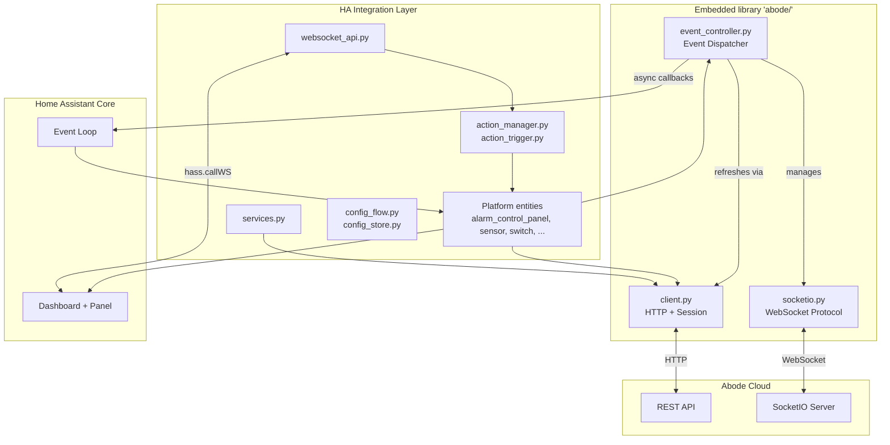
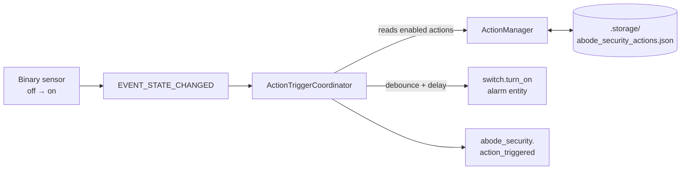
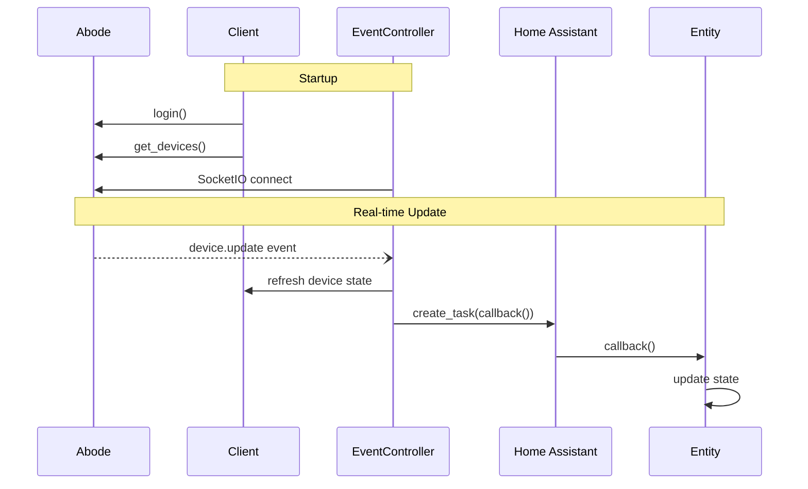

# Architecture

## Overview

This integration bridges Abode security systems with Home Assistant. It ships a vendored, modernized fork of `jaraco.abode` (in `custom_components/abode_security/abode/`) and a thin outer layer of HA platforms, services, a WebSocket API, and a Lit-based frontend panel.



## Layering

| Layer | Location | Role |
|---|---|---|
| Embedded library | `custom_components/abode_security/abode/` | Async Abode client, SocketIO protocol, event dispatch, device abstractions |
| HA integration | `custom_components/abode_security/` (top level) | Platforms, services, config flow, actions, WebSocket API |
| Frontend | `frontend/src/` | Lit-based configuration panel served at `/abode_security` |

**Boundary rule:** outer integration imports only from `abode.client`, `abode.exceptions`, `abode.helpers.timeline`, and `abode.devices.*`. Modules like `abode/automation.py`, `abode/state.py`, `abode/settings.py`, `abode/event_controller.py`, `abode/socketio.py`, `abode/_itertools.py` are library-internal.

## Core Components

### Client (`abode/client.py`)

REST API gateway with session management:

- **Async HTTP** via `aiohttp` with connection pooling
- **Session lifecycle**: proactive recreation every 30 min (before Abode's ~1.5h timeout)
- **Retry logic**: 3 attempts, exponential backoff, rate-limit (429) detection
- **Auth**: token management, MFA support, cookie sync to SocketIO

### EventController (`abode/event_controller.py`)

Event dispatcher:

- **Async model**: SocketIO runs as an async task on the HA event loop; async callbacks are dispatched via `asyncio.create_task()`, sync callbacks called inline
- **Callback types**: device updates, timeline events, connection status
- **Event mapping**: Abode event codes → groups (ALARM, ARM, DISARM, TEST, …) via `helpers/timeline.py`

### SocketIO (`abode/socketio.py`)

WebSocket protocol implementation (no external socketio library):

- **Protocol stack**: WebSocket (aiohttp) → EngineIO → SocketIO
- **Reconnection**: exponential backoff, 5–30 s
- **Events**: device updates, mode changes, timeline events

**Where to look first when SocketIO is unhappy**: check `diagnostics.py`'s `"socketio"` keys (`consecutive_connect_failures`, `last_packet_age_seconds`); run `mcp__home_assistant__ha_get_logs` filtered by `custom_components.abode_security`; see `tests/test_socketio_reconnect.py` for the reconnect contract. Broader async patterns are in [`docs/ASYNC_AWAIT_PATTERNS.md`](./ASYNC_AWAIT_PATTERNS.md).

### Devices (`abode/devices/`)

Per-type abstractions over raw Abode JSON. `base.Device` extends `Stateful`; subclasses add type-specific behavior: `alarm.py`, `binary_sensor.py`, `camera.py`, `cover.py`, `light.py`, `lock.py`, `sensor.py`, `switch.py`, `valve.py`. `pkg.py` and `status.py` hold the type registry and state mapping. `_ancestry.py` is a stdlib-only replacement for `jaraco.classes.ancestry.iter_subclasses`.

The `abode/` directory is a vendored fork of `jaraco.abode`. Fork lineage, intentional divergences, and the no-upstream-sync policy are documented in [`custom_components/abode_security/abode/UPSTREAM.md`](../custom_components/abode_security/abode/UPSTREAM.md).

### Helpers (`abode/helpers/`)

- `errors.py` — named error constants (`MFA_CODE_REQUIRED`, `SET_STATUS_STATE`, …) referenced across the library
- `timeline.py` — event-code → group mapping (`RangeMap`) plus CSV loader for metadata
- `urls.py` — endpoint URL templates
- `_collections.py` — stdlib-only `RangeMap` and `BijectiveMap`, replacing `jaraco.collections`

## HA Integration Layer

### Platforms

Standard HA platform modules (`alarm_control_panel.py`, `sensor.py`, `binary_sensor.py`, `switch.py`, `lock.py`, `cover.py`, `light.py`, `camera.py`). `entity.py` hosts base classes (`AbodeEntity`, `AbodeDevice`). `models.py` defines `AbodeSystem` (runtime holder for the client + event controller + stats) and event-filter helpers.

### Services (`services.py`, `services.yaml`)

Eight services grouped by theme:

| Theme | Service | Handler kind |
|---|---|---|
| Settings | `change_setting` | async (API call) |
| Media | `capture_image` | sync (dispatcher signal) |
| Automation | `trigger_automation` | sync (dispatcher signal) |
| Alarms | `trigger_alarm` | async (API call — PANIC, FIRE, MEDICAL, BURGLAR) |
| Timeline | `acknowledge_alarm`, `dismiss_alarm` | async (API call) |
| Test mode | `enable_test_mode`, `disable_test_mode` | async (API call) |

Dispatcher-signal handlers are intentionally sync (see `ASYNC_AWAIT_PATTERNS.md`).

### Actions system (`action_manager.py`, `action_trigger.py`)

User-defined mappings from **sensor activation → alarm trigger**, gated by alarm mode.

- `ActionManager` — CRUD + persistence. Actions live in HA's `Store` API at `.storage/abode_security_actions.json`, keyed by UUID. In-memory cache during runtime.
- `ActionTriggerCoordinator` — listens to `EVENT_STATE_CHANGED`, matches binary-sensor `off→on` transitions against enabled actions, applies per-sensor debounce (default 1.0 s) and per-action delay (0–60 s via `async_call_later`), then calls `switch.turn_on` on the configured alarm entities and fires `abode_security.action_triggered`.
- Trigger state (pending delays, debounce timestamps) is memory-only; lost on restart by design.



### WebSocket API (`websocket_api.py`)

Frontend-facing command registry. All commands namespaced `abode_security/*`:

- **Actions CRUD**: `actions/{list,get,create,update,delete,toggle,test}`
- **Entity queries**: `entities/sensors`, `entities/alarms`, `modes/list`
- **Config**: `config/{get,set}` (debounce, etc.)

Mutating commands (`create`, `update`, `delete`, `toggle`, `config/set`) require admin. `test` directly invokes an alarm trigger without persisting, for form validation.

**Hidden-entity asymmetry.** `entities/sensors` filters out entries where `hidden_by is not None` so users can't accidentally pick a sensor they've intentionally hidden from the UI. The `ActionTriggerCoordinator` *does not* apply the same filter — it listens on `EVENT_STATE_CHANGED` regardless of `hidden_by`, so existing actions referencing a now-hidden sensor keep firing. Hiding an entity is a UI-clutter decision, not a "retire this automation" signal.

### Config flow (`config_flow.py`, `config_store.py`)

| Step | Purpose |
|---|---|
| `user` | Username + password |
| `mfa` | Conditional, when Abode challenges for a code |
| `reauth` | Re-prompts password on `ConfigEntryAuthFailed` |
| Options flow | Polling interval, event enable, retry count, debug logging |

Storage split:

- **Entry data** (immutable after install) — username, password, polling flag
- **Entry options** (user-modifiable) — polling interval, event enable, retry count, debug logging
- **Config store** (`.storage/abode_security_config.json`, managed by `ConfigStore`) — runtime settings like action-trigger debounce; separate from entry so tweaks don't require reauth

## Frontend Panel (`frontend/src/`)

Lit component `abode-configuration-panel`, registered as HA panel at `/abode_security`, served from `custom_components/abode_security/www/`. Built from `frontend/` (TypeScript + Lit + esbuild).

Two tabs:

- **Actions** — list with enable/disable/edit/delete/test, plus a form editor that multi-selects sensors and alarm entities
- **Modes** — Standby / Home / Away with active indicator and per-mode action counts

Communication is **WebSocket-only** via `hass.callWS()`; no custom REST endpoints. Command schemas live in `frontend/src/api.ts`.

## Data Flow



## Key Patterns

### Async Callbacks

```python
# _execute_callback — async callbacks as tasks, sync callbacks inline
def _execute_callback(callback, *args, **kwargs):
    if inspect.iscoroutinefunction(callback):
        task = asyncio.create_task(_run_callback_async(callback, args, kwargs))
        task.add_done_callback(lambda t: _log_task_completion(callback, t))
    else:
        callback(*args, **kwargs)
```

### Error Handling Decorator (`decorators.py`)

```python
@handle_abode_errors("operation name")
async def entity_action(self):
    # Errors logged, not propagated to break HA
```

### Timeout-Guarded Executor Jobs

Callback registration via `hass.async_add_executor_job(...)` is wrapped in `asyncio.wait_for(..., timeout=10.0)`; timeouts are treated as non-fatal (polling continues). See `ASYNC_AWAIT_PATTERNS.md` for rationale and call sites.

### Dual Operation Modes

- **Polling** — `async_update()` on HA's interval (fallback and CMS-settings refresh)
- **Event-driven** — real-time via SocketIO for everything else; minimal polling

## Unique Features

1. **Manual alarm triggering** — PANIC, FIRE, MEDICAL, BURGLAR from HA
2. **Custom actions** — sensor-to-alarm mappings gated by mode, with delay and debounce
3. **Timeline event management** — acknowledge/dismiss alarm events
4. **CMS settings control** — test mode, monitoring active, dispatch settings
5. **Smart session management** — proactive recreation, empty-response detection

## File Structure

```
abode-security/
├── custom_components/abode_security/
│   ├── __init__.py              # Setup, entry points, event wiring
│   ├── alarm_control_panel.py   # Alarm entity + manual triggers
│   ├── sensor.py / binary_sensor.py / switch.py / ...   # HA platforms
│   ├── entity.py                # Base classes
│   ├── models.py                # AbodeSystem, stats, event filter
│   ├── decorators.py            # @handle_abode_errors
│   ├── services.py / services.yaml
│   ├── config_flow.py / config_store.py
│   ├── action_manager.py / action_trigger.py
│   ├── websocket_api.py
│   ├── diagnostics.py
│   ├── www/                     # Built panel artifacts
│   └── abode/                   # Embedded jaraco.abode fork
│       ├── client.py            # REST API, session mgmt
│       ├── event_controller.py  # Event dispatcher
│       ├── socketio.py          # WebSocket protocol
│       ├── devices/             # Per-type device models
│       └── helpers/             # Timeline, errors, URLs, collections
├── frontend/src/                # Lit panel (TypeScript)
├── tests/                       # Unit + integration + e2e + mock server
└── docs/                        # This doc, async patterns, past reviews
```

## Related Docs

- [`ASYNC_AWAIT_PATTERNS.md`](./ASYNC_AWAIT_PATTERNS.md) — async design decisions and call-site inventory
- [`archive/CODE_REVIEW_2025_11_25.md`](./archive/CODE_REVIEW_2025_11_25.md) — prior async-focused review (historical snapshot)
